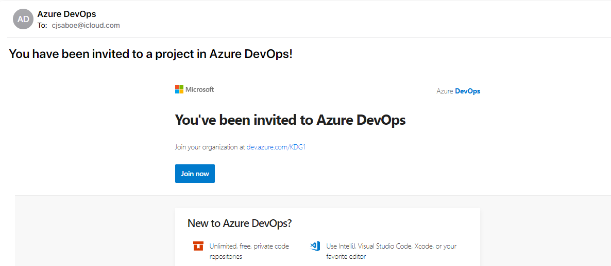
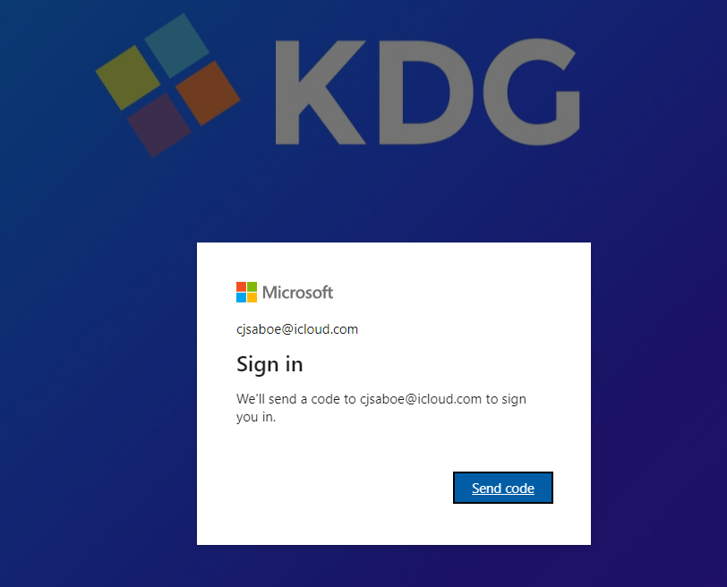
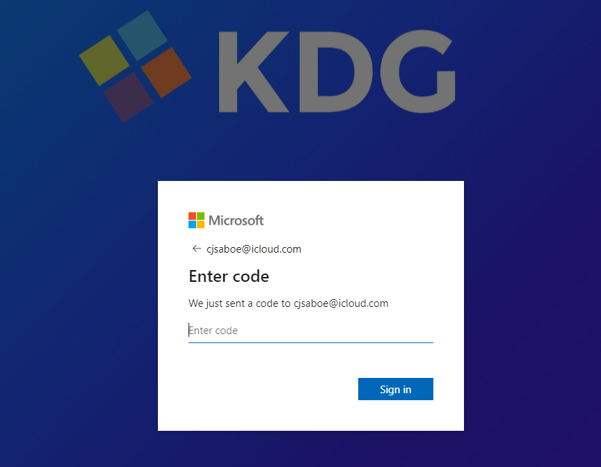
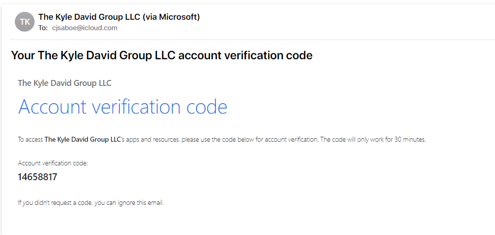
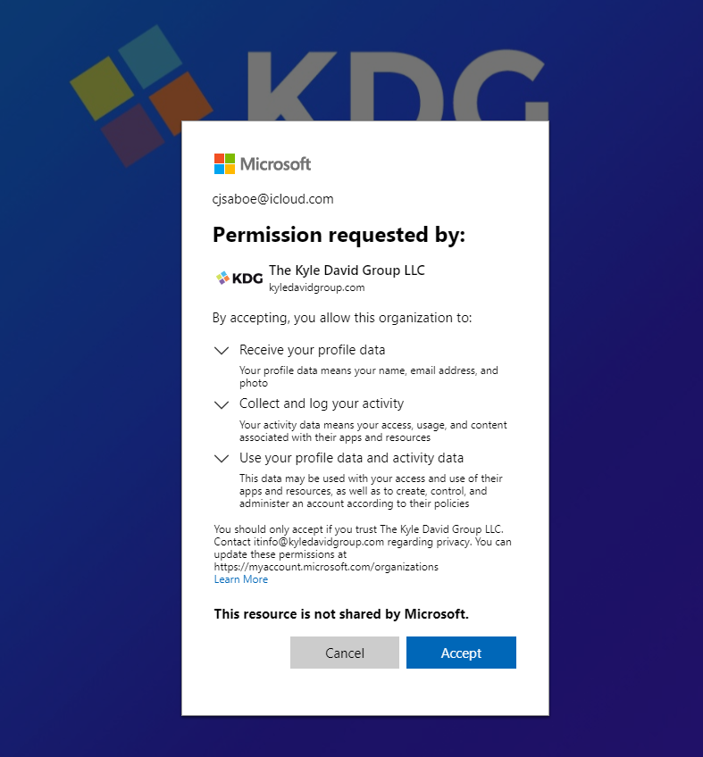
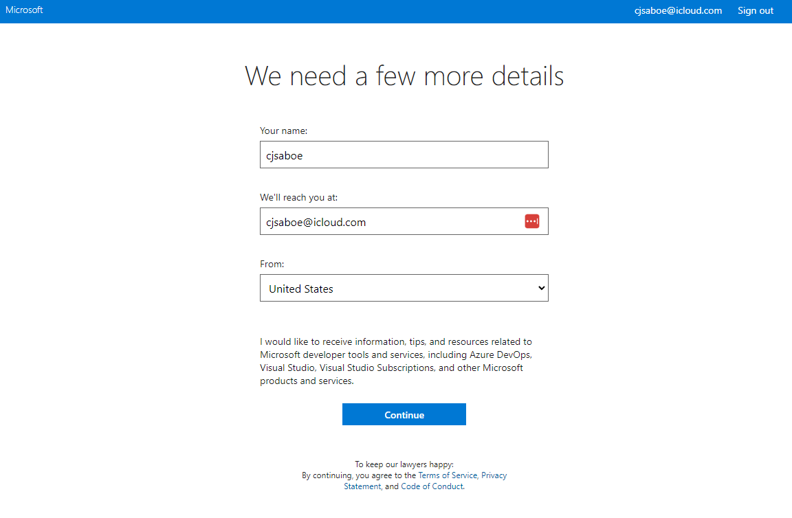
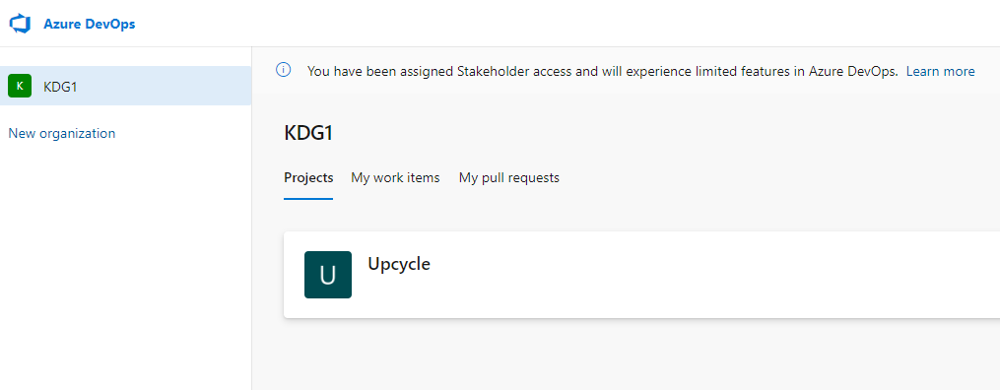

Title: Adding External User to Azure DevOps
Date: 2023-08-29 10:49:00
Modified: 2023-08-29 10:49:00
Category: 
Tags: 
Slug: 
Summary: 
Status: draft

Walkthrough For Invited User

[Invites User in ADO]

[Gets Email]

[Click Link]

Sees this below page:

"Send Code"

[Get Email, Copy Code]

[Enter Into "Enter Code" page, click "Sign in"]

[Gets permission request page, click "Accept"]

[Microsoft Account Creation for this email]

[Continue]

