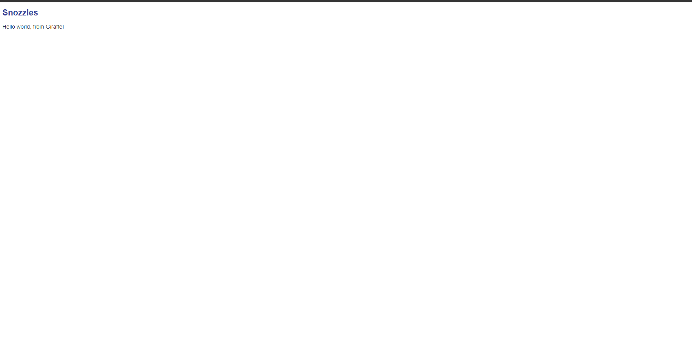

## Build The Basic Site
``` 
> dotnet new -i "giraffe-template::*" 
> dotnet new giraffe
> dotnet build
> dotnet run
```

... and you should get this magnificent interface:



## Sample Apps
https://github.com/giraffe-fsharp/samples/tree/master/demo-apps

## Future Edits


## Docs
