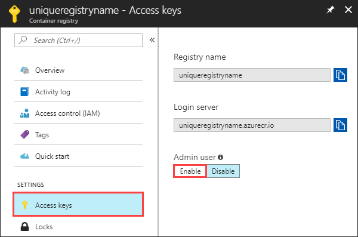

Create a basic starter Dockerfile

```
FROM mcr.microsoft.com/appsvc/dotnetcore:lts

ENV PORT 8080
EXPOSE 8080

ENV ASPNETCORE_URLS "http://*:${PORT}"

ENTRYPOINT ["dotnet", "/defaulthome/hostingstart/hostingstart.dll"]
```

Enable the 'Admin user' to create the username and password for the next step.


Use the Docker CLI to login - this will request the username and password from above.
```
docker login myregistry.azurecr.io
```

Open the Command Palette, and type Docker Images: Build Image. Type Enter to run the command.

In the image tag box, specify the tag you want in the following format: <acr-name>.azurecr.io/<image-name>/<tag>, where <acr-name> is the name of the container registry you created. Press Enter.

Should now see image (latest) under the Docker extension in VS Code.

Right-click image and select 'Push'.

In the REGISTRIES explorer, expand the image, right-click the tag, and select Deploy image to Azure App Service.
Follow the prompts to choose a subscription, a globally unique app name, a resource group, and an App Service plan. Choose B1 Basic for the pricing tier, and a region near you.

### References
- https://docs.microsoft.com/en-us/azure/app-service/quickstart-custom-container?tabs=dotnet&pivots=container-linux
